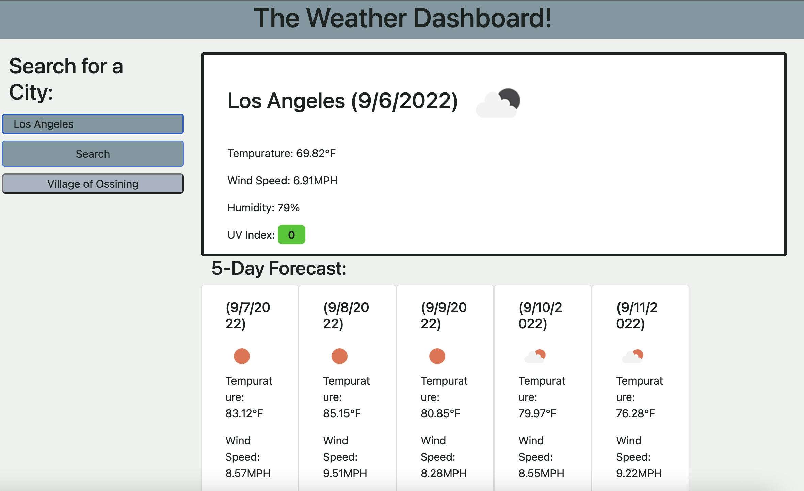

# module-6-chalenge

## Deployed Link
https://youseph-codes.github.io/module-6-chalenge/

## Description

In this project, I was tasked with creating a weather dashboard that allows you to search for a city and see its current weather, along with the 5 day forecast. This web application must show a city's tempurature, its humidity, its wind speed, and the UV index. 

## Images

